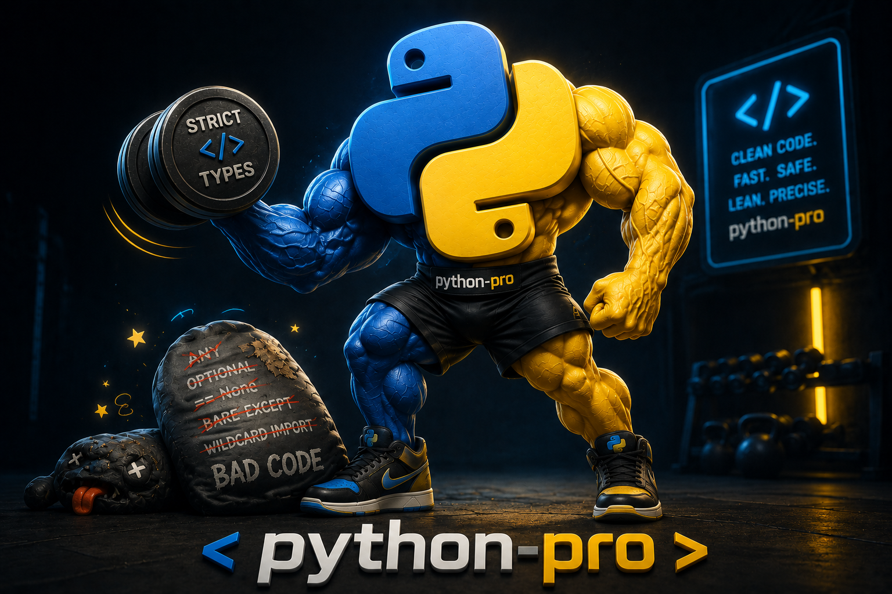
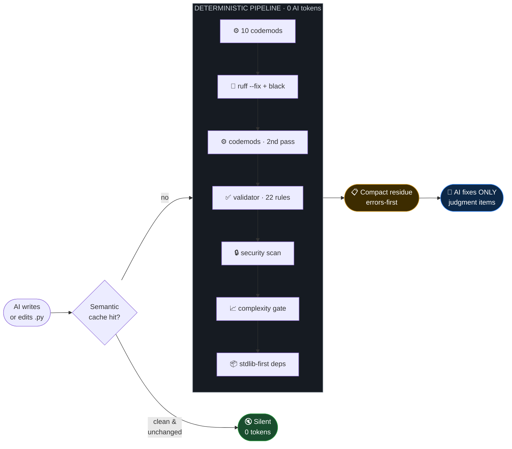
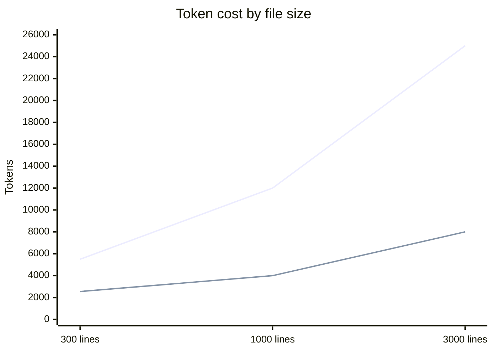
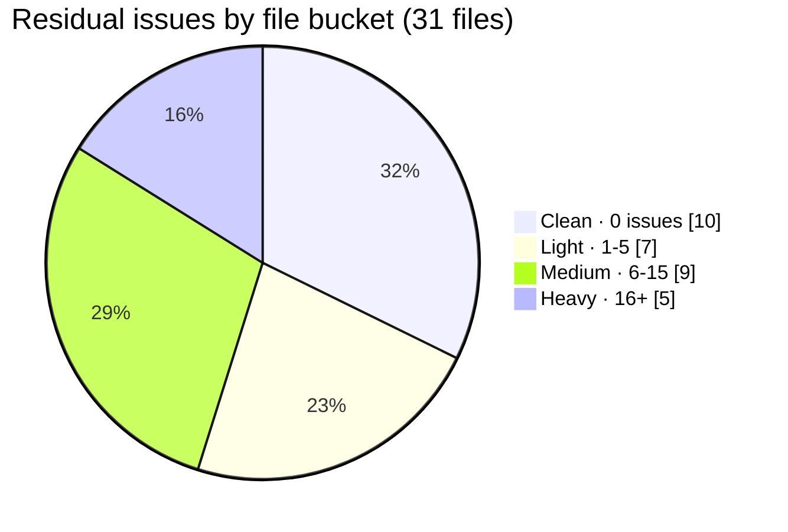
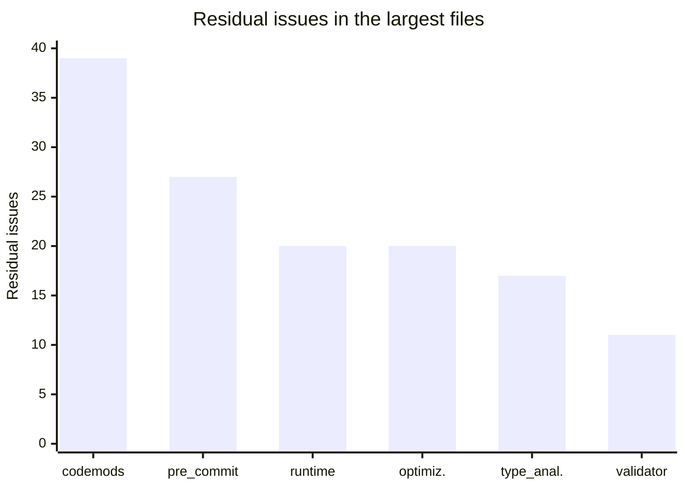

<p align="center">
  
</p>

<div align="center">

# python-pro

**A production Python 3.11+ standard that turns any AI coding agent into a senior Python engineer.**

*Code is fixed by **code**, not by tokens — the AI only ever sees what actually needs judgment.*

<br>


<a href="https://github.com/Kigrok/python-pro/stargazers"></a>

<br>

<a href="https://github.com/Kigrok/python-pro/releases/latest"></a>
<a href="https://github.com/Kigrok/python-pro/releases"></a>
<a href="https://github.com/Kigrok/python-pro/network/members"></a>
<a href="https://github.com/Kigrok/python-pro/issues"></a>


<br>


<br><br>

[**Why**](#-why-this-exists) ·
[**How**](#️-how-it-works) ·
[**Tokens**](#-token-economics) ·
[**Benchmarks**](#-real-benchmarks) ·
[**Install**](#-installation) ·
[**Box**](#-whats-in-the-box)

</div>

---

## 🎯 Why this exists

AI writes Python fast — and sloppy. Loose typing, `import *`, `except:`, mutable defaults,
missing `__slots__`, no annotations, legacy `Optional[...]`. You then burn tokens **and**
patience: asking it to clean up, pasting linter output back, waiting for another full rewrite.

**python-pro flips the loop.** A deterministic pipeline fixes everything mechanical the
instant a file is written — with **zero AI tokens** — and hands the agent back only the
handful of issues that genuinely require thought.

<table>
<tr>
<th width="50%">❌ Without python-pro</th>
<th width="50%">✅ With python-pro</th>
</tr>
<tr>
<td>

- AI rewrites the **whole file** to fix formatting
- You paste linter errors back manually
- 3+ round-trips per file
- Tokens spent on `List` → `list`
- Inconsistent quality per session

</td>
<td>

- Pipeline auto-fixes mechanics — **0 tokens**
- Agent gets a compact errors-first checklist
- **1 round-trip**
- Tokens spent on **real problems**
- Same production standard every time

</td>
</tr>
</table>

> Works with **Claude Code · Cursor · Windsurf · GitHub Copilot · Codex** — or any tool, via CLI/MCP.

---

## ⚙️ How it works



Everything mechanical happens **before** the AI is asked to think. One core (`cli/`) powers
four surfaces: the **skill** (rule set), the **MCP server** (50 tools), the **on-edit hooks**,
and a **live LSP** that pushes violations into your editor.

---

## 👀 See it in one edit

**An AI just wrote this** — 18 standard violations:

```python
import json
import os
from typing import Optional, List, Dict

def get_config(path=[]):                       # 🔴 mutable default, no types
    if os.path.exists("x"):                    # 🔴 import x, no annotations
        return json.load(open("x"))
    result = None
    return result                              # 🔴 unused temp

class Cache:                                   # 🔴 no __slots__, no docstring
    def __init__(self):                        # 🔴 no -> None
        self.store = {}
    def get(self, k):
        try:
            return self.store[k]
        except:                                # 🔴 bare except
            pass

def process(items: List[str], opts: Optional[Dict] = None) -> Optional[str]:
    if items == None:                          # 🔴 == None
        return None
```

**The pipeline runs on save — `0` AI tokens — and applies 8 fixes automatically:**

```diff
+ #!/usr/bin/env python3
+ # dirty.py — ...
+ from __future__ import annotations

  def get_config(path=None):          # 🟢 mutable default → None + init
+     if path is None:
+         path = []
      if os.path.exists("x"):
          return json.load(open("x"))
      return None                     # 🟢 unused temp inlined

  class Cache:
+     __slots__: tuple[str, ...] = ('store',)   # 🟢 slots from self.x
      def __init__(self) -> None:     # 🟢 -> None added
          self.store = {}
```

<div align="center">

`shebang` · `path comment` · `future.annotations` · `__slots__` · `-> None` · `bare except fix` · `Optional[X] → X | None` · `List[X] → list[X]`
**— all deterministic, all free.**

</div>

**The AI receives only the residue that needs a human-level decision:**

```console
dirty.py: 10 issue(s) remain after auto-fix
  :9   [docstring]     get_config() missing docstring
  :9   [annotation]    get_config() missing return type
  :16  [docstring]     class Cache missing docstring
  :5   [import]        use 'from json import ...' not 'import json'
  :23  [broad_except]  'except Exception' is overbroad; catch a specific type
  ...
```

> It never spends a token **noticing** the 8 mechanical problems. It just fixes the 10 that matter.

---

## 💰 Token economics

### Three mechanisms, zero tokens for mechanics

| Mechanism | What it eliminates | AI cost |
|:---|:---|:---:|
| 🔧 **Deterministic pipeline** | 10 codemods + `ruff --fix` + `black` apply every mechanical fix | **`0`** |
| 📋 **Compact residue** | Agent sees a short errors-first checklist, not a re-dumped file | `~100–250` |
| 💾 **Semantic AST cache** | Unchanged clean files skipped entirely — hook stays silent | **`0`** |

### Traditional loop vs python-pro — one dirty ~300-line module

```mermaid
xychart-beta
    title "Tokens per fix cycle (lower is better)"
    x-axis ["AI reads", "Rewrite", "Paste errors", "Re-fix", "Total"]
    y-axis "Tokens" 0 --> 6000
    bar [2000, 2000, 500, 1000, 5500]
    bar [0, 2000, 150, 400, 2550]
```



<div align="center">

🔵 **Traditional** ≈ 5,500 tokens · 3 round-trips  🟢 **python-pro** ≈ 2,550 tokens · 1 round-trip

</div>

| | Traditional | python-pro | Saved |
|:---|:---:|:---:|:---:|
| **Tokens per file** | ~5,500 | ~2,550 | **≈ 54%** |
| **Round-trips** | 3 | 1 | **−67%** |
| **Re-touch a clean file** | ~2,000 | `0` (cache) | **100%** |

> *Model assumes ~4 chars/token; savings grow with file size and every additional edit.*

### Savings scale with file size



<div align="center">🔵 Traditional grows linearly · 🟢 python-pro stays flat (mechanics are free)</div>

---

## 📊 Real benchmarks

Ran the deterministic pipeline over the plugin's own `cli/` package — **31 real production files.**

<table align="center">
<tr>
<td align="center"><h3>31</h3>files processed</td>
<td align="center"><h3>8,793</h3>lines of code</td>
<td align="center"><h3>~118ms</h3>avg / file</td>
<td align="center"><h3>32%</h3>files 100% clean</td>
</tr>
</table>

### Where the residue lands (per-file, post auto-fix)



> **10 of 31 files come out completely clean** — the agent is handed nothing to do.
> The remaining files surface only judgment-required issues (docstrings, return-type inference,
> narrowing broad excepts) — never formatting, never imports, never `__slots__`.

### Heaviest files — residue vs size



---

## ✨ Why your code actually gets better

python-pro doesn't just reformat — it enforces a **262-rule production standard** distilled from
official sources (PEP 8/257/484/585/604/695, `docs.python.org`, mypy, bandit, pydantic v2,
FastAPI, SQLAlchemy 2.0), organised under **nine Prime Directives**:


| 🎯 You get | Automatically, on every file |
|:---|:---|
| 🛡️ **Bulletproof typing** | No `Any`, no `Optional`; concrete containers; passes strict mypy/pyright |
| 🪶 **Lean runtime** | `__slots__` / `dataclass(slots=True)`, generators over lists, bounded caches |
| 🔒 **Secure by default** | No `eval`/`exec`/`shell=True`, parameterised SQL, `secrets` for tokens, no untrusted `pickle` |
| 📦 **Stdlib-first** | Flags `requests`→`httpx`, `pytz`→`zoneinfo`, `psycopg2`→`asyncpg` + ~24 more |
| 📖 **Readable** | `match/case` over `if/elif`, guard clauses over pyramids, one function = one job |

> Nothing ships past the gate: a **22-rule AST validator**, a **security scan**, and a
> **cyclomatic-complexity gate (CC > 10)** run on every edit — with no AI call.

---

## 📥 Installation

**Requires Python 3.11+.** First, clone and set up the environment (all surfaces share it):

```bash
git clone https://github.com/Kigrok/python-pro.git
cd python-pro
python3 -m venv .venv && .venv/bin/pip install -r requirements.txt
```

Then pick your tool below. 👇

<details open>
<summary><b>🤖 Claude Code</b> — full plugin (MCP + hooks + LSP + subagents)</summary>

<br>

**Option A — install as a marketplace plugin (recommended)**

From inside Claude Code, add this repo as a marketplace, then install:

```shell
# add the marketplace (from a local clone…)
/plugin marketplace add ./python-pro

# …or straight from GitHub
/plugin marketplace add Kigrok/python-pro

# install the plugin
/plugin install python-pro@python-pro-dev

# activate without restarting
/reload-plugins
```

**Option B — load a local directory (fastest for dev)**

```bash
claude --plugin-dir ./python-pro
```

**Option C — auto-load from your skills directory**

```bash
ln -s "$(pwd)/python-pro" ~/.claude/skills/python-pro
# restart Claude Code — loads as python-pro@skills-dir
```

The MCP server launches via `${CLAUDE_PLUGIN_ROOT}/bin/run-mcp.sh` and the LSP via
`bin/run-lsp.sh` — both wired automatically. See [`INSTALL.md`](INSTALL.md) for details.

</details>

<details>
<summary><b>🖱️ Cursor</b> — auto-loaded rules</summary>

<br>

Cursor reads `.cursorrules` from the project root automatically. Just copy it in:

```bash
cp python-pro/.cursorrules /path/to/your/project/.cursorrules
```

Optionally wire the MCP server for on-demand lint/fix tools. Add to Cursor's MCP settings
(`~/.cursor/mcp.json` or **Settings → MCP**):

```json
{
  "mcpServers": {
    "python-pro": {
      "command": "/absolute/path/to/python-pro/bin/run-mcp.sh"
    }
  }
}
```

</details>

<details>
<summary><b>🌊 Windsurf</b> — auto-loaded rules</summary>

<br>

Windsurf reads `.windsurfrules` from the project root automatically:

```bash
cp python-pro/.windsurfrules /path/to/your/project/.windsurfrules
```

For the MCP tools, add the server to Windsurf's MCP config (**Settings → Cascade → MCP**):

```json
{
  "mcpServers": {
    "python-pro": {
      "command": "/absolute/path/to/python-pro/bin/run-mcp.sh"
    }
  }
}
```

</details>

<details>
<summary><b>🐙 GitHub Copilot</b> — chat instructions</summary>

<br>

Copilot reads `.github/copilot-instructions.md` as custom instructions. Copy it into your repo:

```bash
mkdir -p /path/to/your/project/.github
cp python-pro/.github/copilot-instructions.md /path/to/your/project/.github/
```

Copilot Chat and completions now follow the python-pro standard automatically.

</details>

<details>
<summary><b>🔷 Codex · OpenCode · any AGENTS.md agent</b></summary>

<br>

Any tool that honours the [`AGENTS.md`](https://agents.md) convention (OpenAI Codex,
OpenCode, and others) picks up the standard from a root `AGENTS.md`:

```bash
cp python-pro/AGENTS.md /path/to/your/project/AGENTS.md
```

For MCP-capable agents, register the server the same way as above, pointing at
`bin/run-mcp.sh`.

</details>

<details>
<summary><b>💻 Any tool — standalone CLI (zero AI, works today)</b></summary>

<br>

The engine runs completely standalone — no AI required. Point it at any Python file:

```bash
cd python-pro
PYTHONPATH=. python3 -m cli fix   path/to/file.py     # deterministic pipeline, residue only
PYTHONPATH=. python3 -m cli lint  path/to/file.py     # 8-linter report (--json for structured)
PYTHONPATH=. python3 -m cli check path/to/file.py     # syntax only
PYTHONPATH=. python3 -m cli.validator path/to/dir     # python-pro rule report
```

Wire it into a git `pre-commit` hook, CI, or an editor task — see [`INSTALL.md`](INSTALL.md).

</details>

> 🎮 **Try it right now:** `PYTHONPATH=. python3 -m cli fix your_messy_file.py`

---

## 📦 What's in the box

| Component | Count | Description |
|:---|:---:|:---|
| 🧠 **Skill** | `262` rules | `skills/python-pro/SKILL.md` — the authoritative standard, auto-loaded for `.py` work |
| 🔧 **MCP server** | `50` tools | lint/fix/validate · dependency graph · scaffolding & codegen · runtime testing · profiling · security · prompt builders |
| 🪝 **Hooks** | `4` | PreToolUse · PostToolUse · UserPromptSubmit · SessionStart |
| 📡 **LSP server** | `1` | Live python-pro diagnostics in your editor (via pygls) |
| 🤖 **Subagents** | `6` | `api-builder` · `async-auditor` · `python-reviewer` · `refactor-modernizer` · `test-author` · `type-hardener` |
| ⚙️ **Codemods** | `10` | AST fixes ruff/black can't do — `__slots__`, `-> None`, type modernization, `match/case`, import rewrites |
| ✅ **Validator** | `22` rules | Pure-AST enforcement, independent of the linters |
| 🔒 **Gates** | `3` | Security scan · complexity (CC>10) · stdlib-first deps — every edit |
| 💾 **Semantic cache** | `1` | Normalized-AST blake2b hash skips unchanged clean files |
| 🧩 **Linters** | `8` | `ruff` · `flake8` · `mypy` · `pylint` · `pyright` · `vulture` · `black` · `isort` — parallel |

### What runs on every save (0 AI tokens)

| Stage | Tool | Checks / Fixes |
|:---|:---|:---|
| ⚙️ **Codemods** | `cli/codemods.py` | shebang · path comment · `future.annotations` · `__slots__` · `-> None` · bare `except` · `suppress` · type modernization · `match/case` · import rewrite |
| 🎨 **Formatters** | `ruff` · `black` · `isort` | 15 rule families · import sort · formatting |
| ✅ **Validator** | `cli/validator.py` | 22 AST rules (slots, annotations, imports, banned types, comparisons, mutable defaults, bare/broad except, `assert`, `raise from`, …) |
| 🔒 **Security** | `cli/security.py` | `eval` · `exec` · `shell` · `pickle` · `secrets` · weak-hash |
| 📈 **Complexity** | `cli/metrics.py` | Cyclomatic-complexity gate (CC > 10) |
| 📦 **Dependencies** | `cli/deps.py` | Stdlib-first scanner (~24 replacements) |

---

## ✅ Tests

```bash
python3 tests/test_smoke.py     # standalone, no deps — core smoke check
pytest                          # full suite — 39/39 passing
```

---

## 📚 Docs

- 📐 [`CLAUDE.md`](CLAUDE.md) — architecture & commands (start here to hack on it)
- 📏 [`skills/python-pro/SKILL.md`](skills/python-pro/SKILL.md) — the full 262-rule standard
- ⚙️ [`docs/codemods.md`](docs/codemods.md) — every codemod, with before/after
- 📦 [`INSTALL.md`](INSTALL.md) · [`AGENTS.md`](AGENTS.md) · [`DOCS.md`](DOCS.md) · [`REPORT.md`](REPORT.md)

---

<div align="center">
  <sub><b>MIT</b> · Python 3.11+ · <i>code fixed by code, tokens spent on meaning</i></sub>
</div>
